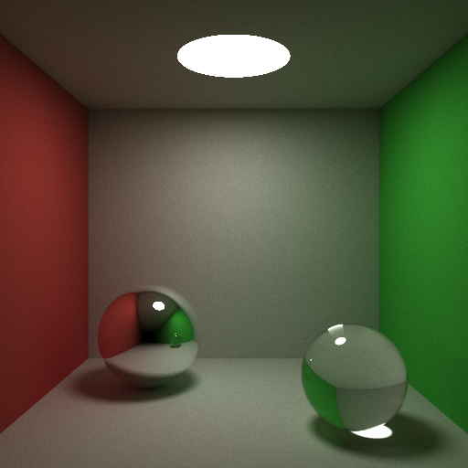
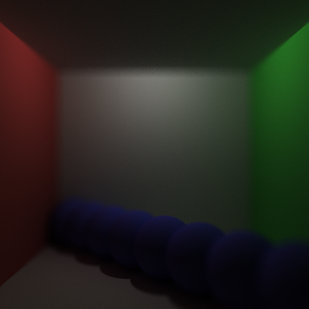
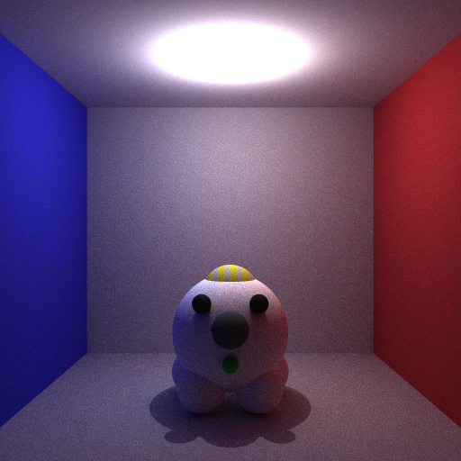
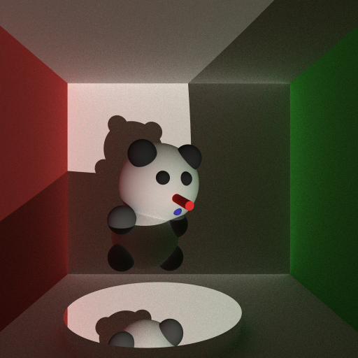

##Giraffe: Distributed Monte Carlo Path Tracer
[中文版 README](./README.md)

###Giraffe is a Distributed Monte Carlo Path Tracer which has its own path tracing language, written in C++11/14

***
####Giraffe

***

###Features
* Multi BRDF(diffuse, reflect, refract, glossy, specular...)
* Global illumination
* Monte Carlo Integration(Uniform Sampling, Stratified Sampling)
* Distributed Path Tracing
* Russian Roulette
* Texture
	- Solid Texture(Brick, Stripe, Image, Grid, Spot)
	- Procedural Texture(Perlin Noise)
	- Cellular Texture(Worley Noise)
* Anti-aliasing
* Depth of field
* Light(Point, Directional, Area, Texture)
* Object(Plane, Triangle, Sphere, Quad, Cylinder, Disk)
* Acceleration data structures
	- BVH
		+	AABB (Axis-Aligned Bounding Box)
		+	DOP	(Discrete Oriented Polytopes)
* Giraffe Path Tracing Language

####Reflection & Refraction

####Brick Texture

####Depth of Field

####Puppy

####Bear

***

####If you are interested in Giraffe
`Enter src directory and make && ./Giraffe puppy 4(puppy is in directory scene, all file in scene is Ok, 4 means sample number, default is 1, you can change it to 8, 16... Also you need to have header file png.h and compiler that supports C++11/14, if not, change parameter 14 to 11 in Makefile)`
