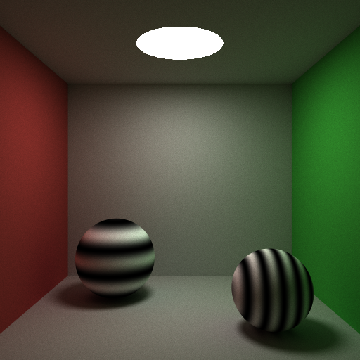

##Giraffe 光线追踪器
[English Version of README](./README.en.md)

###特点
* 漫反射, 镜面反射
* 折射
* 反走样
* 全局光照
* Russian Roulette
* Procedural Texture
	-	砖块
	- 条纹
	- 图像
* Perlin Noise
	- 大理石
* Depth of field
* 物体
	- 三角形
	- 球
	- 四棱柱
	- 圆柱
	- 圆盘
* 光源
	- 点光源
	- 方向光
* 加速数据结构
	- BVH
		+	AABB (Axis-Aligned Bounding Box)
		+	DOP	(Discrete Oriented Polytopes)

####反射折射

####条纹纹理

####砖块纹理

