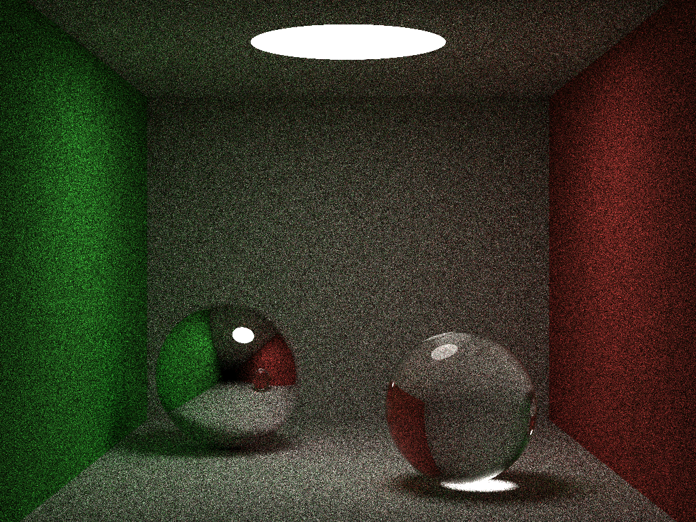
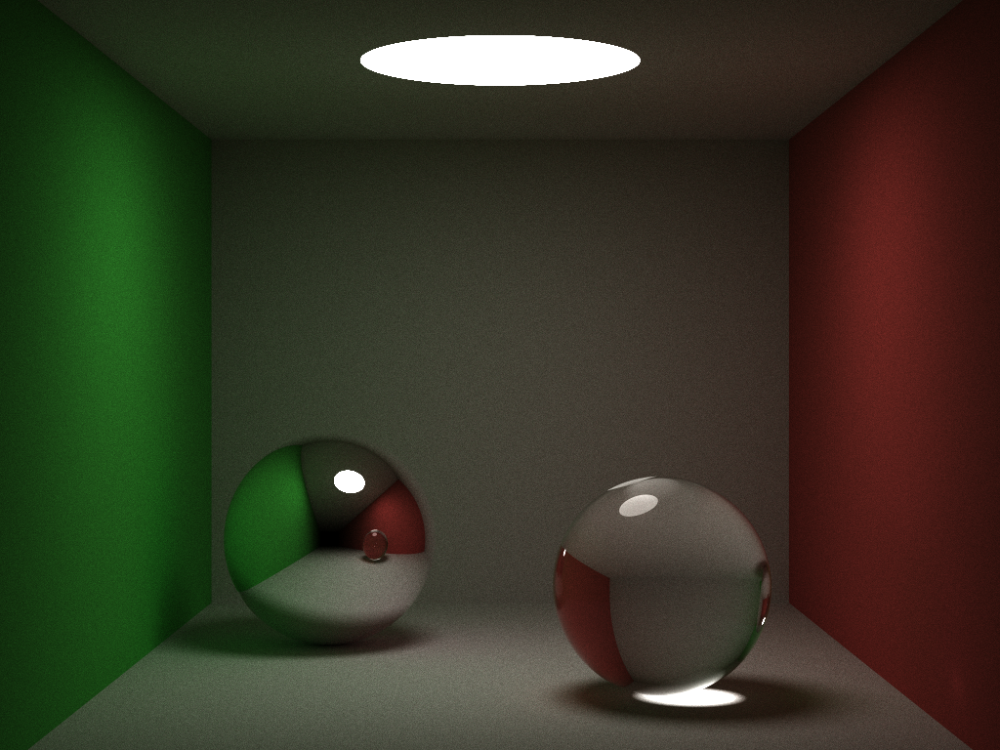
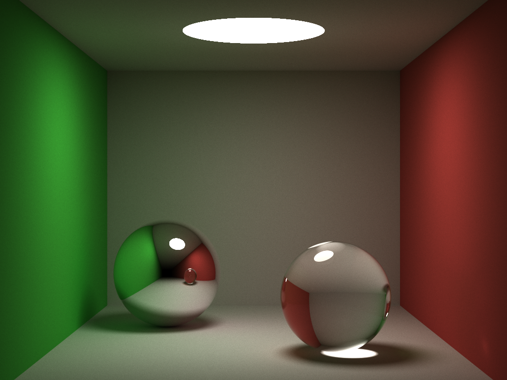
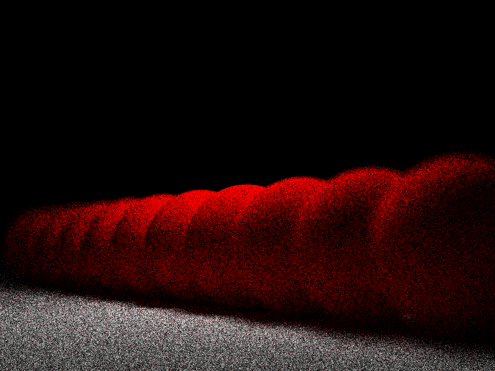

###光线追踪器
###特点
* 漫反射
* 镜面反射
* 折射
* Motion Blur
* 反走样
* 全局渲染
* Russian Roulette
* BVH
	-	AABB (Axis-Aligned Bounding Box)
	-	DOP	(Discrete Oriented Polytopes)

###Cornell Box
	64 samples

	4096 samples

	32768 samples

###Depth of Field
	64 samples

	4096 samples

###参考资料
+ [smallpt](http://kevinbeason.com/smallpt/)
+ [scratch a pixel](http://www.scratchapixel.com/index.php)
+ [CMU 15-462](http://www.cs.cmu.edu/afs/cs/academic/class/15462-s15/www/)
+ [PBRT](https://github.com/mmp/pbrt-v3)
+ Fundamentals of Computer Graphics
+ Realistic Ray Tracing
+ Physically-Based Image Synthesis: From Theory to Implementation
+ Real-Time Rendering
+ 计算机图形学(Peter Shirley, 第二版中文版)
